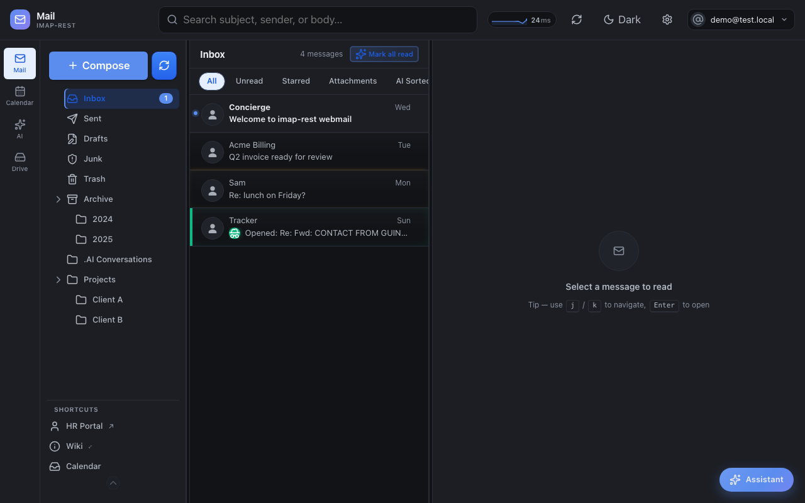
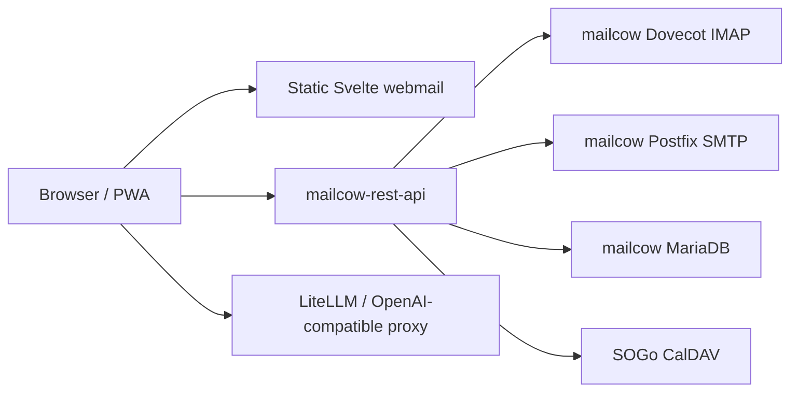
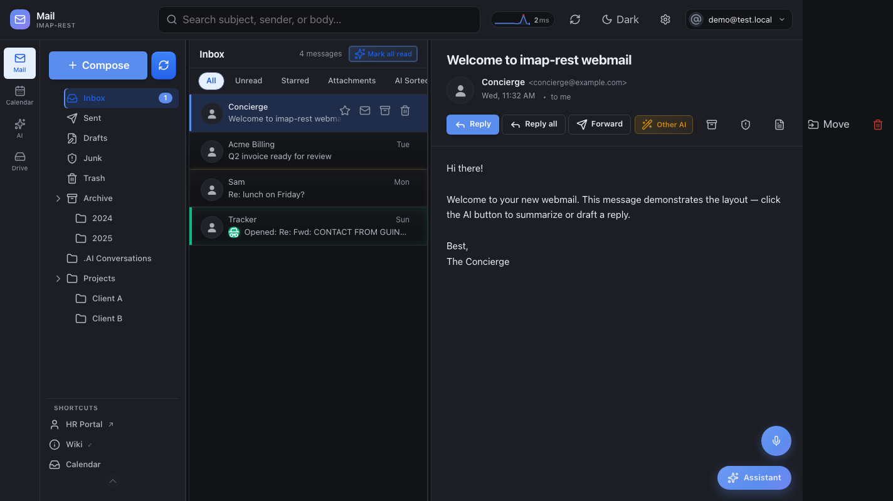
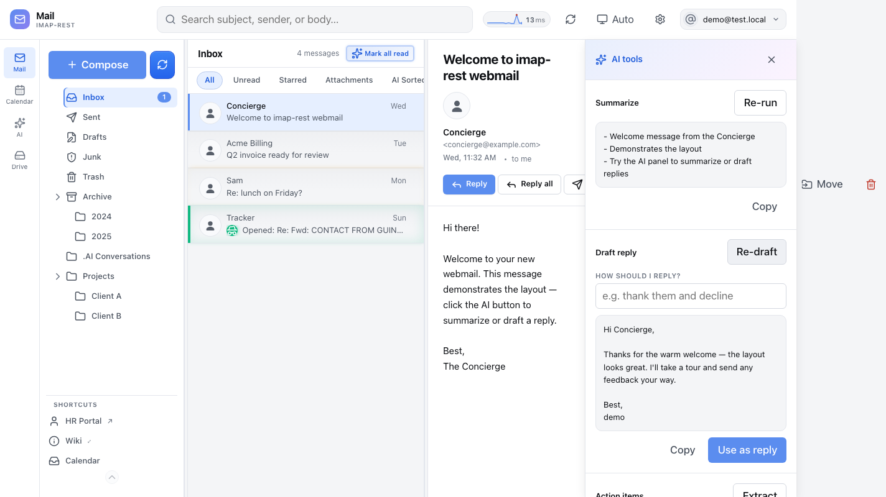
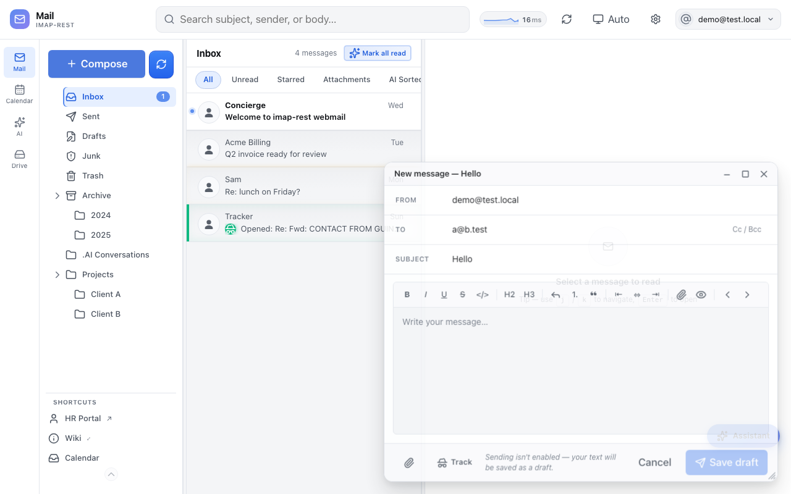
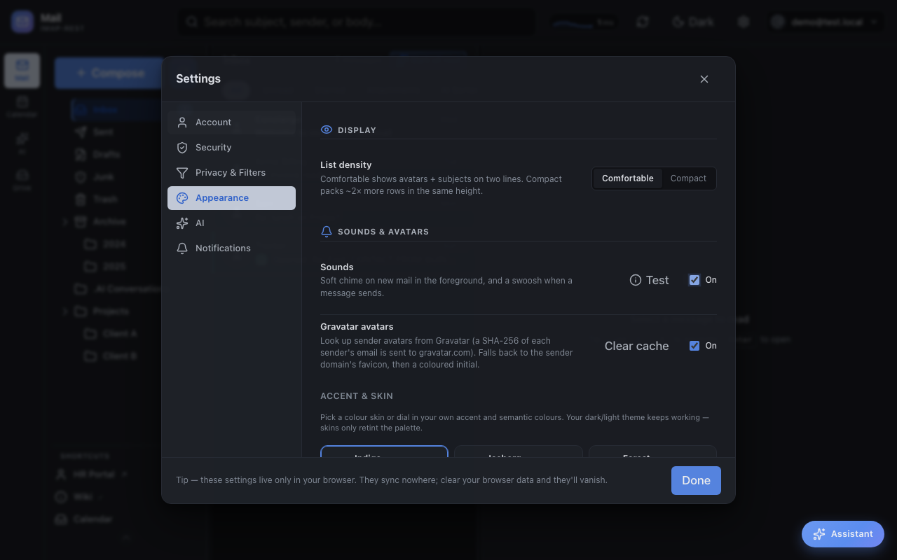
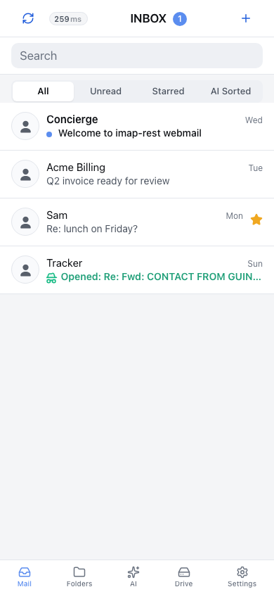

# mailcow-rest-api-webmail

[](https://github.com/jr551/mailcow-rest-api-webmail/actions/workflows/test.yml)
[](https://github.com/jr551/mailcow-rest-api-webmail/actions/workflows/publish-image.yml)


**Alpha:** this frontend is public and usable, but it is still an alpha webmail client. Expect fast changes, rough edges, and missing polish in some workflows.

`mailcow-rest-api-webmail` is the Svelte 5 webmail frontend for [`mailcow-rest-api`](https://github.com/jr551/mailcow-rest-api). It ships a desktop mail UI plus a mobile/PWA experience styled around an iOS Mail-like flow.



## Quick Start

The frontend is static, but the browser must be able to reach `mailcow-rest-api` on the same origin:

```text
/webmail/*     -> this static webmail
/v1/*          -> mailcow-rest-api
/health        -> mailcow-rest-api
/openapi.json  -> mailcow-rest-api
```

Run the full example stack beside mailcow:

```sh
cp docker-compose.example.yml docker-compose.yml
cp .env.example .env
docker compose up -d
npm run check:config -- --url http://localhost:8080
```

Run only the static webmail image for UI inspection:

```sh
docker run --rm -p 8080:80 ghcr.io/jr551/mailcow-rest-api-webmail:master
```

Use the versioned alpha image when you want a fixed tag:

```sh
docker pull ghcr.io/jr551/mailcow-rest-api-webmail:v0.1.0-alpha.1
docker pull ghcr.io/jr551/mailcow-rest-api-webmail:master
```

## Setup Modes

### 1. mailcow Same-Host Nginx

Use the API repo's mailcow setup script to expose the API at `/mailcow-rest-api/`, then add one of the webmail proxy templates from this repo and route:

```text
https://webmail.example.com/webmail/       -> webmail container/static dist
https://webmail.example.com/v1/*           -> https://mail.example.com/mailcow-rest-api/v1/*
https://webmail.example.com/health         -> https://mail.example.com/mailcow-rest-api/health
https://webmail.example.com/openapi.json   -> https://mail.example.com/mailcow-rest-api/openapi.json
```

Templates:

- `deploy/nginx.conf`
- `deploy/Caddyfile`
- `deploy/docker-compose.yml`

For the nginx/Caddy static templates, place the built `dist/` contents at `/var/www/mailcow-rest-api-webmail/webmail/`. The Docker image already has this layout.

### 2. Standalone Docker

Use `docker-compose.example.yml` as a starting point when the API and webmail run beside an existing mailcow Docker network. The webmail nginx image proxies `/v1/*`, `/health`, and `/openapi.json` to the `mailcow-rest-api` service name.

```sh
cp docker-compose.example.yml docker-compose.yml
cp .env.example .env
docker compose up -d
npm run check:config -- --url http://localhost:8080
```

The compose file expects the public `mailcowdockerized_mailcow-network` Docker network. Override with `MAILCOW_NETWORK=...` if your mailcow install uses a different name.

### 3. Vercel Or Static Hosting

Build and publish `dist/`:

```sh
npm install
npm run build
```

Use `deploy/vercel.json` as the Vercel rewrite template. Replace `https://mail.example.com/mailcow-rest-api` with your API URL before deploying. The template includes `/webmail/assets/*` rewrites because the Vite build is emitted with `/webmail/` as its asset base.

Static/CDN hosting is fine as long as the final browser origin still serves:

- `/webmail/`
- `/webmail/mobile/`
- `/v1/*`
- `/health`
- `/openapi.json`

## First-Run Diagnostics

The app now runs a browser-side setup check before login. If `/health` or `/openapi.json` cannot be reached, users see a setup screen instead of a vague login/network failure. It shows:

- the detected frontend origin
- the API routes being tested
- the HTTP result for each route
- the likely proxy/hosting fix

The same checks are available from the command line:

```sh
npm run check:config -- --url https://webmail.example.com
```

## Architecture



The webmail package is a static client-side app. The Docker image is only nginx serving built files; there is no webmail application server doing mailbox or AI processing inside this repo.

## AI And Key Privacy

For AI key privacy, do not put one shared provider key directly into a public static frontend. Use LiteLLM or another OpenAI-compatible key broker in front of the model provider, then configure `mailcow-rest-api` to issue scoped client keys. LiteLLM is not included in this repo. My deployment uses DeepSeek V4 Flash through a proxy.

Browser-local user keys are possible for personal use, but they are not a safe way to distribute one shared key to all users.

## Screenshots

Message reading:



AI assistant panel:



Compose:



PWA install/settings:



Mobile inbox snapshot:



## What It Includes

- Desktop mailbox UI with folders, search, filters, message detail, attachments, compose, reply, forward, and multi-account affordances.
- Calendar and drive views backed by the REST API.
- AI assistant workflows for summarising, drafting, sorting, actions, translation, phishing checks, and voice/TTS where configured.
- Tracking, sender policy, blocked-recipient, shortcuts, settings, density, theme, and PWA install surfaces.
- Mobile entry point at `/webmail/mobile/` with an iOS Mail-inspired layout for inbox, message reading, compose, folders, and settings.

## Development

```sh
npm install
VITE_DEV_API_TARGET=http://localhost:3001 npm run dev
npm run check
npm run build
```

`VITE_DEV_API_TARGET` is only for the Vite dev proxy. Production routing is handled by your web server, CDN, or platform rewrites.

## Pair With The API

Use this frontend with the API image:

```sh
docker pull ghcr.io/jr551/mailcow-rest-api:master
docker pull ghcr.io/jr551/mailcow-rest-api-webmail:master
```

The API Swagger UI lives at `/` on the API service, or `/mailcow-rest-api/` if you use the public API setup script from the API repo.
